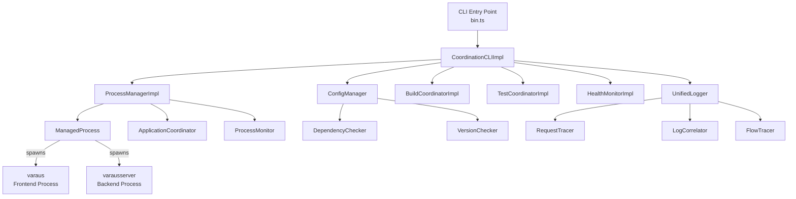

# Design Document - Coordination System

## Overview

The Coordination System is a TypeScript CLI tool that orchestrates the Varaus sauna reservation frontend (`varaus`) and backend (`varausserver`) applications as a unified development and deployment unit. It provides a single `coordination` command with subcommands for starting, building, testing, monitoring, logging, deploying, and inspecting the status of both applications.

The system is structured as a set of loosely-coupled modules — CLI, Config, Process, Build, Test, Health, and Logging — each responsible for a distinct concern. The CLI module acts as the entry point, delegating to the other modules. Configuration is environment-aware (development, staging, production) and validated against a schema before any operation proceeds. Process management handles spawning, stopping, and restarting child processes with signal handling. Build and test coordination enforce dependency ordering (backend before frontend for builds, parallel for tests). Health monitoring provides HTTP-based liveness checks with Firebase connectivity awareness. Unified logging correlates log entries across both applications using UUID-based correlation IDs, and a flow tracer tracks end-to-end request timing.

Cross-platform setup is handled by Bash and PowerShell scripts that verify Node.js ≥ 20, install dependencies across all three project directories, create environment templates, and build the coordination system.

## Architecture



The architecture follows a layered approach:

1. **CLI Layer** (`src/cli/`) — Parses arguments, dispatches to `CoordinationCLIImpl`, handles exit codes and signal registration.
2. **Configuration Layer** (`src/config/`) — Loads environment variables, validates schema and cross-application compatibility, checks dependency versions and Node.js compatibility.
3. **Process Layer** (`src/process/`) — Manages child process lifecycle (`ManagedProcess`), coordinates ordered startup (`ApplicationCoordinator`), and monitors for crashes/file changes (`ProcessMonitor`).
4. **Build Layer** (`src/build/`) — Executes `npm run build` in dependency order with environment injection and error parsing.
5. **Test Layer** (`src/test/`) — Executes `npm test` in parallel for both applications and parses Mocha-format output.
6. **Health Layer** (`src/health/`) — HTTP-based health checks with Firebase endpoint awareness, continuous monitoring, and overall status determination.
7. **Logging Layer** (`src/logging/`) — Unified log capture with correlation IDs, request tracing, log correlation, and flow tracing with timing breakdowns.

All modules communicate through well-defined TypeScript interfaces. The `types.ts` file provides shared type definitions used across all modules.

## Components and Interfaces

### CLI Module (`src/cli/`)

**`bin.ts`** — The `#!/usr/bin/env node` entry point. Parses `process.argv`, validates command/argument combinations, and calls methods on `CoordinationCLIImpl`. Handles `help`/`--help`/`-h`/undefined as help display. Unknown commands print an error and exit with code 1.

**`CoordinationCLIImpl`** — Implements the `CoordinationCLI` interface:
- `start(environment)` — Loads config, starts backend then frontend with connectivity verification, registers SIGINT/SIGTERM handlers.
- `build(environment)` — Loads config, delegates to `BuildCoordinatorImpl.buildAll()`.
- `test(testType)` — Delegates to `TestCoordinatorImpl.runAllTests()`. Integration/e2e types fall back to unit tests with a warning.
- `status()` — Reports process status, memory/CPU, and integration health.
- `logs(application?)` — Placeholder for log streaming.
- `deploy(target)` — Orchestrates config → build → test → deploy → health check pipeline.
- `provideTroubleshootingGuidance(error)` — Pattern-matches error messages to provide actionable guidance.

### Configuration Module (`src/config/`)

**`ConfigManager`** — Implements `ConfigurationManager`:
- `loadConfig(environment)` — Reads environment variables, constructs `SystemConfig`, validates, and returns.
- `validateConfig(config)` — Runs schema validation via `configSchema`, compatibility checks (Firebase projectId/databaseURL match, API endpoint/port alignment, CORS origins), and missing variable detection.
- `getApplicationConfig(app, env)` — Returns frontend or backend config slice.

**`configSchema`** — Type guard validators for `Environment`, `FirebaseConfig`, `FrontendConfig`, `BackendConfig`, and `SystemConfig`.

**`DependencyChecker`** (`dependency-checker.ts`) — Pure functions:
- `findSharedDependencies(frontendPkg, backendPkg)` — Set intersection of dependency names.
- `extractMajorVersion(versionString)` — Strips semver prefixes, extracts leading integer.
- `areVersionsCompatible(v1, v2)` — Compares major versions; unparseable versions are incompatible.
- `checkDependencyCompatibility(...)` / `validateDependencyCompatibility(...)` — Returns conflict list and summary.

**`VersionChecker`** (`version-checker.ts`) — Pure functions:
- `parseMajorVersionRequirement(range)` — Handles `||`, `>=`, `^`, `.x` formats.
- `checkNodeVersionCompatibility(current, required)` — Tests current major against parsed requirement.
- `verifyNodeVersionCompatibility(frontendPkg, backendPkg, currentVersion)` — Per-application results.
- `checkApplicationsNodeCompatibility(...)` — Finds common satisfying major versions.

### Process Module (`src/process/`)

**`ProcessManagerImpl`** — Implements `ProcessManager`:
- `startApplication(app, config)` — Creates `ManagedProcess`, spawns `npm run dev` with injected env vars.
- `stopApplication(app)` — Sends SIGTERM, then SIGKILL after 5s timeout. For `"both"`, stops concurrently.
- `restartApplication(app)` — Stop then start with same config.
- `getProcessStatus(app)` — Returns current `ProcessStatus`.
- `watchForChanges(app, callback)` — Delegates to `ManagedProcess.watchForChanges()`.

**`ManagedProcess`** (private class) — Wraps a `ChildProcess`:
- Captures stdout/stderr as `LogEntry` items (max 1000 per app).
- Tracks status transitions: stopped → starting → running → stopping → stopped/error.
- Builds environment with port, API endpoint, and Firebase config injected.
- File watching via `fs.watch` on `src/` directory.

**`ApplicationCoordinator`** — Orchestrates ordered startup:
- Starts backend → verifies HTTP connectivity → starts frontend → verifies frontend connectivity.
- On failure at any step, cleans up started processes and returns `StartupError` with troubleshooting steps.

**`ProcessMonitor`** — Crash detection and auto-restart:
- Polls process status every 5 seconds.
- Auto-restarts on crash with configurable delay (default 2000ms) and max restart count (default 3).
- File watching with 1000ms debounce triggers restart on source changes.

### Build Module (`src/build/`)

**`BuildCoordinatorImpl`** — Implements `BuildCoordinator`:
- `buildAll(config)` — Builds backend first; if backend fails, skips frontend with an error message.
- `buildApplication(app, config)` — Spawns `npm run build` with environment injection. Sets `NODE_ENV=production` for production, `NODE_ENV=development` otherwise.
- `parseBuildErrors(app, output)` — Regex-based detection of webpack/TypeScript errors, module-not-found, and syntax errors.

### Test Module (`src/test/`)

**`TestCoordinatorImpl`** — Implements `TestCoordinator`:
- `runAllTests()` — Runs backend and frontend tests in parallel via `Promise.all`.
- `runTests(app)` — Spawns `npm test`, parses Mocha output for passing/failing/pending counts and individual failure details.
- `parseTestResults(app, output)` — Regex parsing of Mocha summary lines and numbered failure entries.

### Health Module (`src/health/`)

**`HealthMonitorImpl`** — Implements `HealthMonitor`:
- `checkApplicationHealth(app)` — HTTP GET with configurable timeout (default 5000ms). For backend, additionally checks `/health/firebase` (warns if unavailable).
- `checkIntegrationHealth()` — Checks API connectivity, database connectivity, and CORS status.
- `startContinuousMonitoring()` / `stopContinuousMonitoring()` — Interval-based polling (default 30000ms).
- `determineOverallStatus(frontend, backend)` — unhealthy if any unhealthy, degraded if any degraded, else healthy.
- `collectPerformanceMetrics(app, endpoint)` — Response time, `process.memoryUsage()`, `process.cpuUsage()`.
- Route registry includes `/deleteProfile` in the set of known backend routes for health monitoring.

### Logging Module (`src/logging/`)

**`UnifiedLogger`** — Implements `Logger`:
- `createCorrelationId()` — `randomUUID()`.
- `debug/info/warn/error(message, correlationId?)` — Creates `LogEntry`, stores, outputs to appropriate console method.
- `captureLog(entry)` — Stores and outputs. Trims oldest 10% when exceeding 10000 entries.
- `getLogsByCorrelationId(id)` — Filters stored logs.
- Output format: `{ISO timestamp} [{LEVEL}] [{application}] [{correlationId_prefix_8chars}] {message}`.

**`RequestTracer`** — Tracks `RequestTrace` objects with frontend/backend event lists:
- `startTrace/addEvent/endTrace` — Lifecycle methods.
- `getRequestFlow(id)` — Combined and timestamp-sorted events.
- `clearOldTraces(maxAgeMs)` — Default 1 hour cleanup.

**`LogCorrelator`** — Correlates logs by correlation ID:
- `correlateLogs(id)` — Returns `{frontend, backend, timeline}`.
- `analyzeRequestTiming(id)` — Calculates total, frontend, and backend durations.

**`FlowTracer`** (`flow-tracer.ts`) — End-to-end request flow tracking:
- `startFlow/addStage/completeStage/endFlow` — Stage-based lifecycle.
- `calculateTimingBreakdown(flow)` — Categorizes stage durations into frontend processing, backend processing, database operations (stages containing "database", "db", or "firebase"), and network latency (remainder).
- `formatTimeline(events)` — Human-readable timeline with elapsed time, application, event name, and duration.
- `clearOldFlows(maxAgeMs)` — Default 1 hour cleanup.

### Setup Scripts (`scripts/`)

**`setup.sh`** (Bash) and **`setup.ps1`** (PowerShell):
- Verify Node.js ≥ 20.
- Install npm dependencies in `coordination/`, `varausserver/`, and `varaus/`.
- Create `.env.template` if no `.env` exists.
- Build the coordination system (`npm run build`).
- Display next steps.

## Data Models

### Shared Types (`src/types.ts`)

```typescript
type Environment = 'development' | 'staging' | 'production';
type ApplicationName = 'frontend' | 'backend' | 'both';
type LogLevel = 'debug' | 'info' | 'warn' | 'error';
type ProcessStatus = 'starting' | 'running' | 'stopping' | 'stopped' | 'error';
type ConnectivityStatus = 'connected' | 'disconnected' | 'degraded';
type CORSStatus = 'configured' | 'misconfigured' | 'unknown';

interface FirebaseConfig {
  apiKey: string; authDomain: string; databaseURL: string;
  projectId: string; storageBucket: string;
  messagingSenderId: string; appId: string;
}

interface LogEntry {
  timestamp: Date; level: LogLevel;
  application?: ApplicationName; message: string;
  correlationId?: string;
}

interface MemoryUsage { heapUsed: number; heapTotal: number; external: number; }
interface CPUUsage { user: number; system: number; }
interface IntegrationStatus {
  apiConnectivity: ConnectivityStatus;
  databaseConnectivity: ConnectivityStatus;
  crossOriginStatus: CORSStatus;
}
```

### Configuration Models

```typescript
interface SystemConfig {
  frontend: FrontendConfig;
  backend: BackendConfig;
  shared: SharedConfig;
}

interface FrontendConfig {
  apiEndpoint: string; firebaseConfig: FirebaseConfig;
  buildOutputPath: string; devServerPort: number;
}

interface BackendConfig {
  port: number; firebaseConfig: FirebaseConfig;
  corsOrigins: string[]; logLevel: LogLevel;
}

interface SharedConfig { environment: Environment; projectRoot: string; }
```

### Process Models

```typescript
interface ProcessHandle { pid: number; port?: number; status: ProcessStatus; logs: LogStream; }
interface ProcessConfig { port?: number; apiEndpoint?: string; firebaseConfig?: any; environment?: string; projectRoot?: string; }
interface MonitorConfig { autoRestart: boolean; maxRestarts: number; restartDelay: number; watchFiles: boolean; }
```

### Build/Test Models

```typescript
interface BuildAllResult { success: boolean; backend: ApplicationBuildResult; frontend: ApplicationBuildResult; totalDuration: number; }
interface ApplicationBuildResult { success: boolean; application: ApplicationName; artifacts: BuildArtifactInfo[]; duration: number; errors?: BuildErrorInfo[]; output: string; }
interface BuildErrorInfo { application: ApplicationName; phase: string; message: string; file?: string; line?: number; column?: number; }

interface TestAllResult { success: boolean; backend: ApplicationTestResult; frontend: ApplicationTestResult; totalDuration: number; }
interface ApplicationTestResult { success: boolean; application: ApplicationName; testsPassed: number; testsFailed: number; testsSkipped: number; duration: number; failures: TestFailureInfo[]; output: string; }
```

### Health Models

```typescript
interface HealthStatus { status: 'healthy' | 'degraded' | 'unhealthy'; checks: HealthCheck[]; lastChecked: Date; performance?: PerformanceMetrics; }
interface HealthCheck { name: string; status: 'pass' | 'fail' | 'warn'; message?: string; duration: number; }
interface PerformanceMetrics { responseTime?: number; memory: MemoryUsage; cpu: CPUUsage; }
```

### Logging/Tracing Models

```typescript
interface FlowTrace { correlationId: string; startTime: Date; endTime?: Date; totalDuration?: number; stages: FlowStage[]; timingBreakdown: TimingBreakdown; }
interface FlowStage { name: string; application: ApplicationName; startTime: Date; endTime?: Date; duration?: number; status: 'pending' | 'completed' | 'failed'; }
interface TimingBreakdown { frontendProcessing: number; networkLatency: number; backendProcessing: number; databaseOperations: number; totalRoundTrip: number; }
```


## Correctness Properties

*A property is a characteristic or behavior that should hold true across all valid executions of a system — essentially, a formal statement about what the system should do. Properties serve as the bridge between human-readable specifications and machine-verifiable correctness guarantees.*

### Property 1: Unknown commands are rejected with identifying error

*For any* string that is not one of the valid commands (start, build, test, status, logs, deploy, help), the CLI should reject it with an error message that contains the unknown command string and should indicate a non-zero exit code.

**Validates: Requirements 1.2**

### Property 2: Environment validation accepts only valid environments

*For any* string, the environment validator should return true if and only if the string is one of "development", "staging", or "production". All other strings should be rejected.

**Validates: Requirements 2.1, 2.2**

### Property 3: Required environment variable names are correctly derived from environment

*For any* valid environment, the set of required environment variable names should include `FRONTEND_API_ENDPOINT`, `BACKEND_PORT`, and all seven Firebase variables prefixed with the uppercase environment name (e.g., `DEVELOPMENT_FIREBASE_API_KEY`).

**Validates: Requirements 2.3**

### Property 4: Missing environment variable errors identify variable, application, and environment

*For any* required environment variable that is missing, the thrown error message should contain the variable name, the application that requires it, and the target environment name.

**Validates: Requirements 2.4**

### Property 5: Firebase configuration consistency validation

*For any* system configuration where the frontend and backend Firebase `projectId` or `databaseURL` values differ, the config validator should report a validation error.

**Validates: Requirements 2.5, 2.6**

### Property 6: Development API endpoint warning

*For any* development environment configuration where the frontend `apiEndpoint` does not contain the backend port number as a substring, the config validator should produce a warning.

**Validates: Requirements 2.7**

### Property 7: CORS origin warning

*For any* configuration where the backend `corsOrigins` array does not include the frontend origin, the config validator should produce a warning.

**Validates: Requirements 2.8**

### Property 8: Default CORS origins match environment

*For any* valid environment, when no `BACKEND_CORS_ORIGINS` environment variable is set, the default CORS origins should be `["http://localhost:8080"]` for development, `["https://staging.varaus.example.com"]` for staging, and `["https://varaus.example.com"]` for production.

**Validates: Requirements 2.9**

### Property 9: Configuration schema validation rejects invalid configs

*For any* configuration object where: the Firebase config is missing any of the seven required string fields, or the backend port is not a number, or the backend logLevel is not one of {debug, info, warn, error}, or corsOrigins is not an array of strings, or the frontend devServerPort is not a number, or apiEndpoint/buildOutputPath are not strings — the schema validator should return false.

**Validates: Requirements 3.1, 3.2, 3.3, 3.4, 3.5, 3.6, 3.7**

### Property 10: Shared dependency identification is set intersection

*For any* two package.json objects, the list of shared dependencies returned by `findSharedDependencies` should be exactly the set intersection of the union of (dependencies + devDependencies) keys from each package.

**Validates: Requirements 4.1**

### Property 11: Dependency version incompatibility detection

*For any* two version strings with different major versions (where both are parseable), `areVersionsCompatible` should return false. For unparseable version strings, it should also return false.

**Validates: Requirements 4.3, 4.4**

### Property 12: Dependency compatibility summary consistency

*For any* pair of package.json objects, the `compatible` flag in the result of `validateDependencyCompatibility` should be true if and only if the `conflicts` list (incompatible dependencies) is empty.

**Validates: Requirements 4.5**

### Property 13: Node.js version compatibility checking

*For any* current Node.js major version and version range requirement, `checkNodeVersionCompatibility` should return true if and only if the current major version is in the set of major versions parsed from the requirement. The common versions between two applications should be the intersection of their individual parsed version sets, and `compatible` should be false when this intersection is empty.

**Validates: Requirements 5.1, 5.3, 5.4, 5.5**

### Property 14: Process status is always a valid state

*For any* application tracked by the Process Manager, `getProcessStatus` should always return one of: "starting", "running", "stopping", "stopped", or "error".

**Validates: Requirements 7.1**

### Property 15: Log entry count per application never exceeds 1000

*For any* sequence of log entries added to a ManagedProcess, the stored log entry count should never exceed 1000. When the limit is reached, the oldest entry should be removed.

**Validates: Requirements 7.9**

### Property 16: NODE_ENV mapping from environment

*For any* build configuration, if the environment is "production" then `NODE_ENV` should be set to "production"; for "development" or "staging", `NODE_ENV` should be set to "development".

**Validates: Requirements 9.4, 9.5**

### Property 17: Backend build failure blocks frontend build

*For any* build-all execution where the backend build fails, the frontend build result should indicate it was skipped (not executed), and the overall result should be unsuccessful.

**Validates: Requirements 9.2**

### Property 18: Build error parser detects known error patterns

*For any* build output string containing webpack/TypeScript error patterns (e.g., `ERROR in ./file.ts:10:5`), module-not-found patterns, or syntax error patterns, the `parseBuildErrors` function should return at least one `BuildErrorInfo` entry with the application name and error message.

**Validates: Requirements 9.6, 9.8**

### Property 19: Mocha output parser extracts correct counts

*For any* string containing Mocha-format summary lines (e.g., "N passing", "M failing", "K pending"), the `parseTestResults` function should extract the correct integer values for passed, failed, and skipped counts.

**Validates: Requirements 10.3, 10.4**

### Property 20: Test summary totals are consistent

*For any* test-all result, the total passed count should equal `backend.testsPassed + frontend.testsPassed`, and the total failed count should equal `backend.testsFailed + frontend.testsFailed`.

**Validates: Requirements 10.5**

### Property 21: Overall health status determination

*For any* combination of frontend and backend health statuses, the overall status should be "unhealthy" if either is "unhealthy", "degraded" if either is "degraded" and neither is "unhealthy", and "healthy" otherwise.

**Validates: Requirements 11.6, 11.7, 11.8**

### Property 22: Correlation ID is valid UUID format

*For any* correlation ID generated by `createCorrelationId()`, the result should match the UUID v4 format pattern.

**Validates: Requirements 13.1**

### Property 23: Log entry capture and retrieval by correlation ID

*For any* set of log entries captured with various correlation IDs, `getLogsByCorrelationId(id)` should return exactly the entries that were logged with that specific correlation ID, and no others.

**Validates: Requirements 13.4**

### Property 24: Log entry count never exceeds maximum

*For any* number of log entries captured by the UnifiedLogger, the stored count should never exceed 10000. When trimming occurs, the oldest 10% of entries should be removed.

**Validates: Requirements 13.5**

### Property 25: Log level routing to correct console method

*For any* log entry, error-level logs should be routed to `console.error`, warn-level to `console.warn`, debug-level to `console.debug`, and info-level to `console.log`.

**Validates: Requirements 13.6**

### Property 26: Log correlation separates and sorts correctly

*For any* set of log entries with a shared correlation ID, `correlateLogs` should return frontend entries containing only entries with `application === 'frontend'`, backend entries containing only entries with `application === 'backend'`, and a timeline that is sorted by timestamp in ascending order.

**Validates: Requirements 14.1, 14.3**

### Property 27: Request timing analysis duration consistency

*For any* set of correlated log entries, the calculated `totalDuration` should be >= `frontendDuration` and >= `backendDuration`.

**Validates: Requirements 14.2**

### Property 28: Flow stage duration calculation

*For any* completed flow stage, the recorded `duration` should equal `endTime - startTime` in milliseconds.

**Validates: Requirements 15.2**

### Property 29: Timing breakdown invariant

*For any* completed flow, the timing breakdown should satisfy: `frontendProcessing + backendProcessing + databaseOperations + networkLatency === totalRoundTrip`, and `networkLatency >= 0`.

**Validates: Requirements 15.3, 15.5**

### Property 30: Database stage classification

*For any* flow stage whose name (lowercased) contains "database", "db", or "firebase", the timing breakdown should classify that stage's duration under `databaseOperations`.

**Validates: Requirements 15.4**

### Property 31: Flow cleanup removes only old flows

*For any* set of active flows with various start times, calling `clearOldFlows(maxAgeMs)` should remove exactly those flows whose age exceeds `maxAgeMs` and retain all others.

**Validates: Requirements 15.7**

### Property 32: Deployment target validation

*For any* string, the deployment target parser should accept it if and only if it is "staging" or "production". All other strings (and undefined) should be rejected.

**Validates: Requirements 16.1, 16.3**

### Property 33: Troubleshooting guidance pattern matching

*For any* error message string, the troubleshooting guidance function should: mention ".env" if the message contains "Missing required environment variable"; mention "port" if it contains "EADDRINUSE"; mention "npm install" if it contains "ENOENT" or "Cannot find module"; mention "Firebase" if it contains "Firebase"; and provide general steps for unmatched patterns.

**Validates: Requirements 17.1, 17.2, 17.3, 17.4, 17.5**

## Error Handling

### Configuration Errors
- Missing environment variables throw with a message identifying the variable name, requiring application, and target environment.
- Schema validation failures aggregate all errors and throw before any process starts.
- Firebase config mismatches between frontend and backend are reported as validation errors.

### Process Errors
- Starting an already-running application throws an error.
- Process crashes set status to "error" and trigger auto-restart if enabled (up to max restart count).
- Graceful shutdown sends SIGTERM first, escalates to SIGKILL after 5 seconds.
- Startup connectivity failures trigger cleanup of all started processes and provide troubleshooting guidance.

### Build Errors
- Build output is parsed for webpack/TypeScript errors, module-not-found, and syntax errors.
- Backend build failure aborts the entire build pipeline (frontend is skipped).
- Build errors include application name, phase, message, and file location when available.

### Test Errors
- Test execution failures (process errors) are caught and reported as a single failure entry.
- Mocha output parsing gracefully handles missing summary lines.

### Health Check Errors
- HTTP request timeouts default to 5000ms.
- Firebase health endpoint unavailability produces a warning, not a failure.
- Integration health checks default to "disconnected" or "degraded" on error.

### Deployment Errors
- Missing or invalid deployment target prints an error and exits with non-zero code.
- Build failure during deployment aborts with build error details.
- Test failure during deployment aborts with failed test count.
- Deployment errors are caught and returned as unsuccessful `DeploymentResult`.

### Logging Errors
- Missing correlation IDs in trace/flow operations log a warning and return gracefully.
- Log overflow is handled by trimming the oldest 10% when exceeding 10000 entries.

## Testing Strategy

### Unit Tests
Unit tests verify specific examples, edge cases, and integration points:
- CLI command parsing for each valid command and invalid inputs.
- Configuration loading with specific environment variable sets.
- Schema validation with known valid and invalid config objects.
- Build error pattern matching against specific error strings.
- Mocha output parsing against sample test output.
- Project structure verification (directory existence, file presence).

### Property-Based Tests
Property-based tests verify universal properties across randomly generated inputs. The project uses **fast-check** (already installed as a dev dependency) with **Mocha** as the test runner and **Chai** for assertions.

Each property test:
- Runs a minimum of 100 iterations.
- References its design document property with a tag comment in the format: `Feature: coordination, Property {number}: {property_text}`.
- Each correctness property is implemented by a single property-based test.

Property tests cover:
- Configuration validation (schema validation, environment derivation, Firebase consistency, CORS defaults).
- Dependency compatibility checking (shared dependency identification, version comparison, summary consistency).
- Node.js version compatibility (version range parsing, compatibility checking).
- Build coordination (NODE_ENV mapping, backend failure blocking, error pattern detection).
- Test result parsing (Mocha output parsing, summary total consistency).
- Health monitoring (overall status determination).
- Logging (correlation ID format, log capture/retrieval, log trimming, level routing).
- Log correlation (separation, sorting, timing analysis).
- Flow tracing (stage duration, timing breakdown invariant, database classification, flow cleanup).
- CLI validation (unknown command rejection, deployment target validation).
- Troubleshooting guidance (error pattern matching).
