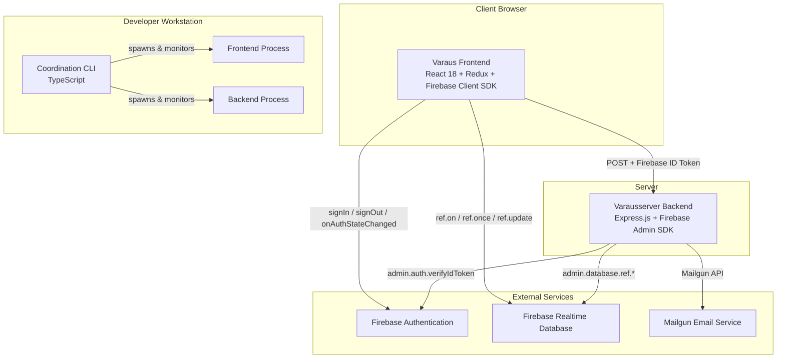
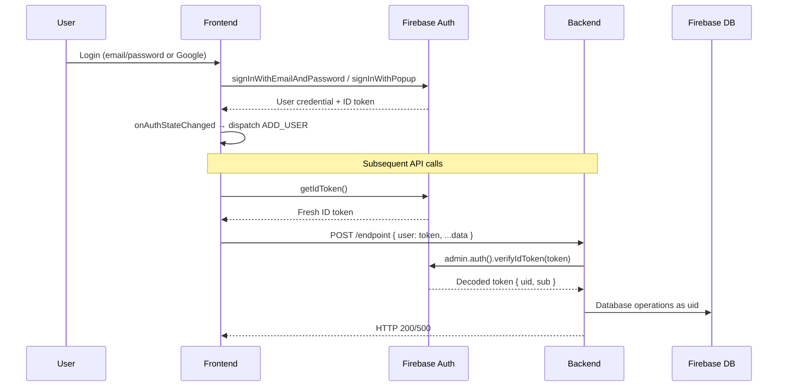
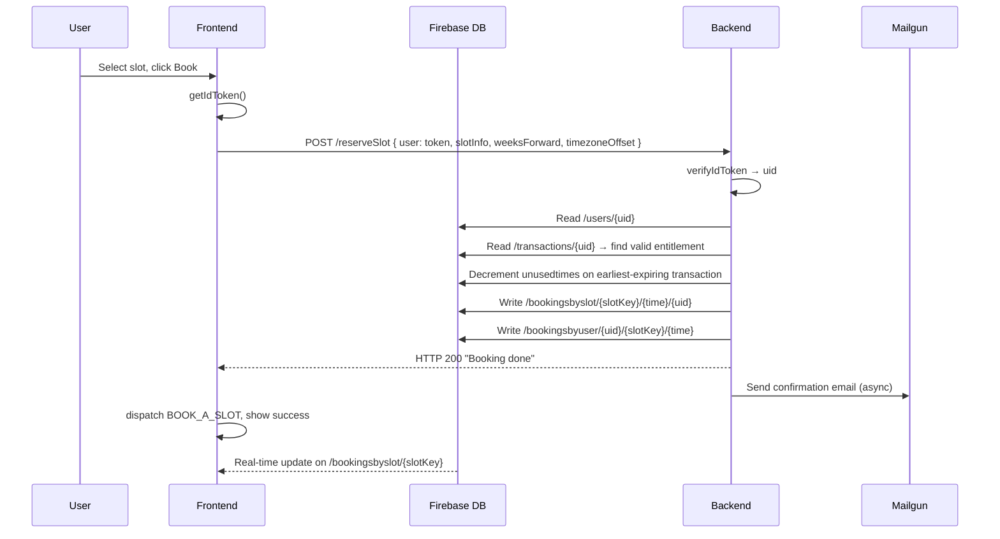
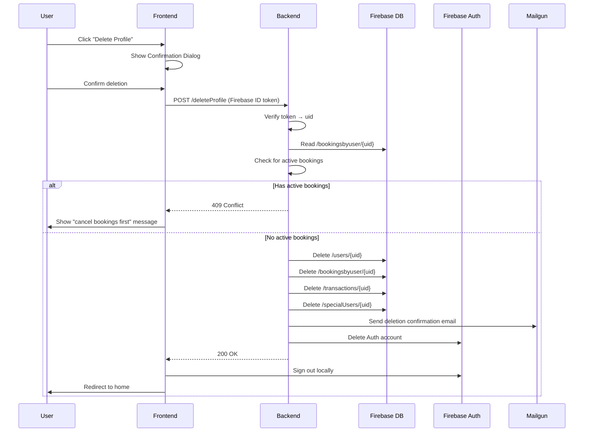
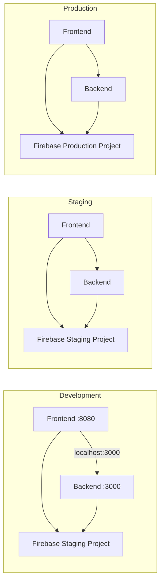
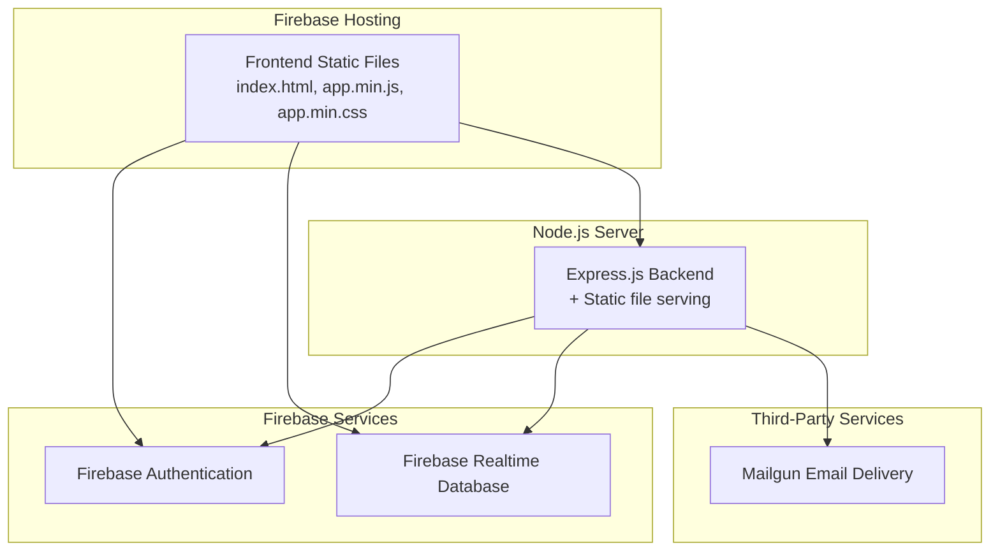

# System Architecture Document — Varaus Sauna Reservation Platform

## Overview

The Varaus platform is a three-tier web application for sauna time slot reservation, built on Firebase as the shared data and identity layer. The frontend is a React SPA that communicates with Firebase Realtime Database for real-time data and with an Express.js backend API for transactional operations. A TypeScript coordination CLI orchestrates both applications for development, build, test, and deployment workflows.

Recent architectural changes:
- **Profile deletion**: A new `POST /deleteProfile` endpoint enables users to permanently delete their profile. The backend enforces an active booking guard (HTTP 409), deletes all user data from four Firebase paths, sends a deletion confirmation email, and removes the Firebase Auth account. The frontend provides a confirmation dialog with active-booking warnings.
- **Paytrail removal**: All Paytrail payment integration has been removed from both frontend and backend. The checkout flow now supports only invoice (delayed) and cash payment methods. Pending transaction cancellation uses a generic client-side Firebase removal mechanism instead of the former Paytrail-specific backend endpoint.

This document describes the top-level system architecture, cross-cutting concerns, and integration contracts between subsystems. Detailed subsystem designs are maintained in:
- Coordination: #[[file:.kiro/specs/coordination/design.md]]
- Frontend: #[[file:.kiro/specs/varaus/design.md]]
- Backend: #[[file:.kiro/specs/varausserver/design.md]]

## System Architecture



## Subsystem Responsibilities

| Subsystem | Technology | Responsibility |
|-----------|-----------|----------------|
| varaus (Frontend) | React 18, Redux, Firebase Client SDK, Webpack | User interface, client-side routing, real-time data display, form handling, payment flow UI (invoice/cash), admin panel, profile deletion with confirmation dialog |
| varausserver (Backend) | Express.js, Firebase Admin SDK, Mailgun | Token verification, booking/cancellation with entitlement checks, payment processing (invoice/cash), transaction management, profile deletion with active booking guard, email notifications |
| coordination (CLI) | TypeScript, Node.js child_process | Unified CLI for start/build/test/deploy/status, environment config management, process lifecycle, health monitoring (including `/deleteProfile` endpoint), unified logging |

## Integration Contracts

### Frontend → Backend API Contract

All communication from frontend to backend uses HTTP POST with JSON bodies containing a Firebase ID token.

```
POST /{endpoint}
Content-Type: application/json

{
  "current_user": "<firebase_id_token>",  // or "user" for booking endpoints
  ...endpoint-specific fields
}

Response: HTTP 200 (success) or HTTP 500 (error)
Content-Type: text/plain
```

**Endpoints by domain:**

| Domain | Endpoints | Auth Level |
|--------|-----------|------------|
| Booking | `/reserveSlot`, `/cancelSlot` | Any authenticated user |
| Checkout | `/checkout` | Any authenticated user |
| Delayed Payment | `/initializedelayedtransaction`, `/notifydelayed` | Any authenticated user |
| Admin Approval | `/approveincomplete` | Admin or instructor |
| Admin Purchase | `/cashbuy` | Admin or instructor |
| Admin Transactions | `/okTransaction`, `/removeTransaction` | Admin only |
| Notifications | `/feedback`, `/notifyRegistration` | Any authenticated user |
| Profile | `/deleteProfile` | Any authenticated user (own profile only) |
| Testing | `/test` | Any authenticated user |

### Frontend ↔ Firebase Contract

The frontend uses the Firebase Client SDK to:
- **Auth**: `signInWithEmailAndPassword`, `signInWithPopup`, `createUserWithEmailAndPassword`, `signOut`, `onAuthStateChanged`, `sendPasswordResetEmail`, `updateEmail`, `updatePassword`
- **Database reads** (real-time listeners): `/slots/`, `/cancelledSlots/`, `/bookingsbyslot/{slotKey}`, `/shopItems/`, `/users/{uid}`, `/specialUsers/{uid}`, `/transactions/{uid}`, `/bookingsbyuser/{uid}`, `/pendingtransactions/`, `/infoItems/`, `/terms/`, `/diagnostics/`
- **Database writes**: `/users/{uid}` (own profile), `/diagnostics/` (session events)

### Backend ↔ Firebase Contract

The backend uses the Firebase Admin SDK with service account `uid: "varausserver"` to:
- **Auth**: `admin.auth().verifyIdToken(token)` on every request
- **Database reads**: `/users/{uid}`, `/transactions/{uid}`, `/shopItems/{key}`, `/specialSlots/{key}`, `/specialUsers/{uid}`, `/pendingtransactions/{key}`, `/bookingsbyslot/`, `/bookingsbyuser/`
- **Database writes**: `/bookingsbyslot/`, `/bookingsbyuser/`, `/scbookingsbyslot/`, `/scbookingsbyuser/`, `/transactions/`, `/pendingtransactions/`, `/serverError/`

### Firebase Security Rules Contract

The security rules enforce a trust boundary:

```
┌─────────────────────────────────────────────────────┐
│ Firebase Realtime Database                          │
│                                                     │
│  Public read:     /infoItems/, /terms/              │
│                                                     │
│  Auth read:       /slots/, /cancelledSlots/,        │
│                   /bookingsbyslot/, /shopItems/,    │
│                   /specialSlots/                    │
│                                                     │
│  Own-user r/w:    /users/{uid}                      │
│  Own-user read:   /bookingsbyuser/{uid},            │
│                   /scbookingsbyuser/{uid},           │
│                   /transactions/{uid},               │
│                   /specialUsers/{uid}               │
│                                                     │
│  Admin r/w:       /pendingtransactions/,            │
│                   /shopItems/, /slots/,              │
│                   /specialSlots/, /infoItems/,       │
│                   /terms/                           │
│                                                     │
│  Server-only w:   /bookingsbyslot/,                 │
│                   /bookingsbyuser/,                  │
│                   /transactions/                    │
│                                                     │
│  Auth write:      /diagnostics/                     │
│  Admin+server r:  /diagnostics/                     │
│  Server write:    /serverError/                     │
└─────────────────────────────────────────────────────┘
```

## Cross-Cutting Concerns

### Authentication Flow



### End-to-End Booking Flow



### End-to-End Profile Deletion Flow



### Environment Configuration



| Environment | Frontend Firebase | Backend Firebase | Backend Port | CORS Origin |
|-------------|------------------|-----------------|-------------|-------------|
| development | varaus-a0250 (staging) | varaus-a0250 (staging) | 3000 | http://localhost:8080 |
| staging | varaus-a0250 (staging) | varaus-a0250 (staging) | configured | https://staging.varaus.example.com |
| production | hakolahdentie-2 (prod) | hakolahdentie-2 (prod) | configured | https://varaus.example.com |

### Coordination Layer Integration

The coordination CLI does not modify the frontend or backend code. It operates externally by:

1. **Configuration**: Reading environment variables and validating cross-application consistency (Firebase project match, CORS alignment, API endpoint/port alignment).
2. **Process management**: Spawning `npm run dev` / `npm run build` / `npm test` as child processes in the respective application directories, with environment variable injection.
3. **Health monitoring**: Making HTTP GET requests to running application endpoints to verify liveness.
4. **Log capture**: Reading stdout/stderr from child processes and correlating entries using UUID-based correlation IDs.

## Data Flow Summary

| Data Flow | Source | Destination | Mechanism | Auth |
|-----------|--------|-------------|-----------|------|
| Slot display | Firebase `/slots/` | Frontend timetable | Firebase `on('value')` | Authenticated user |
| Booking creation | Frontend → Backend → Firebase | `/bookingsbyslot/`, `/bookingsbyuser/` | HTTP POST → Firebase Admin write | ID token verified |
| Booking display | Firebase `/bookingsbyslot/` | Frontend slot detail | Firebase `on('value')` | Authenticated user |
| Transaction creation | Backend → Firebase | `/transactions/{uid}/` | Firebase Admin write | ID token verified |
| Transaction display | Firebase `/transactions/{uid}` | Frontend user view | Firebase `once('value')` | Own user only |
| Pending transaction | Backend → Firebase | `/pendingtransactions/` | Firebase Admin push | ID token verified |
| Pending transaction cancel | Frontend → Firebase | `/pendingtransactions/{id}` | Firebase client `remove()` | Authenticated user |
| Shop items | Firebase `/shopItems/` | Frontend shop | Firebase `once('value')` | Authenticated user |
| User profile | Frontend ↔ Firebase | `/users/{uid}` | Firebase client read/write | Own user only |
| Profile deletion | Frontend → Backend → Firebase + Auth | `/users/{uid}`, `/bookingsbyuser/{uid}`, `/transactions/{uid}`, `/specialUsers/{uid}`, Auth account | HTTP POST → Firebase Admin delete + Auth delete | ID token verified, own UID only |
| Admin data | Frontend ↔ Firebase | Various admin paths | Firebase client read/write | Admin role checked |
| Email notifications | Backend → Mailgun | User email | Mailgun API | Server-side only |
| Diagnostics | Frontend → Firebase | `/diagnostics/` | Firebase client write | Authenticated user |
| Error logging | Backend → Firebase | `/serverError/` | Firebase Admin write | Server-side only |

## Deployment Architecture



The frontend builds to static files (`app.min.js`, `app.min.css`) served from the `public/` directory. The backend also serves these static files as a fallback. Firebase Hosting can be used for the frontend, while the backend runs as a standalone Node.js process.

## Technology Stack Summary

| Layer | Technology | Version |
|-------|-----------|---------|
| Frontend framework | React | 18.x |
| State management | Redux + redux-thunk | 4.x |
| Routing | React Router | 6.x |
| Frontend build | Webpack + Babel | 5.x |
| Frontend testing | Mocha + Chai + JSDOM | — |
| Backend framework | Express.js | 4.x |
| Backend build | Webpack + Babel | 5.x |
| Authentication | Firebase Authentication | Client SDK + Admin SDK |
| Database | Firebase Realtime Database | Client SDK + Admin SDK |
| Email delivery | Mailgun | mailgun-js |
| Coordination CLI | TypeScript + Node.js | — |
| Runtime | Node.js | ≥ 20.x |
