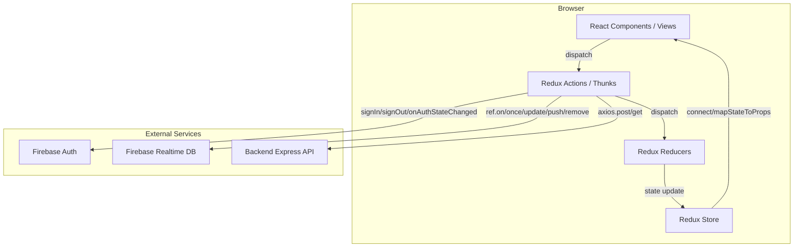
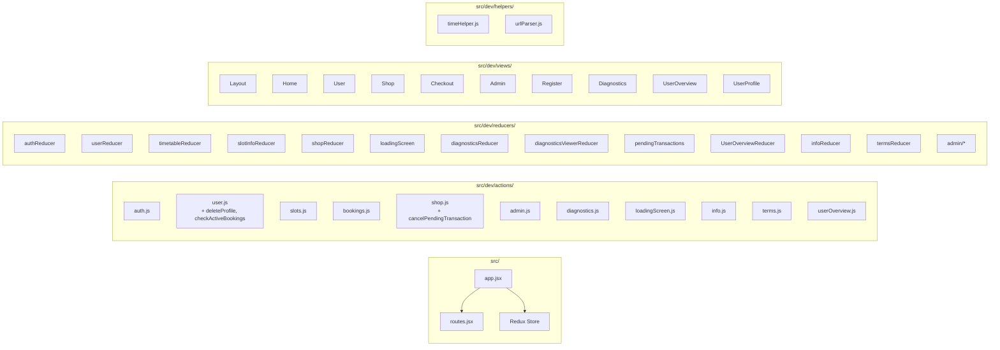

# Design Document - Varaus Frontend

## Overview

Varaus is a React 18 single-page application for sauna time slot reservation. The frontend uses HashRouter for client-side routing, Redux with redux-thunk for state management, and communicates with Firebase Realtime Database for data persistence and Firebase Authentication for user identity. A backend Express.js API handles transactional operations (bookings, payments, notifications).

The application serves two user personas: regular users who browse timetables, book slots, and purchase access tokens; and administrators/instructors who manage users, slots, shop items, content, and pending transactions.

Key technology choices:
- **React 18** with `createRoot` API and class components (legacy codebase)
- **Redux 4** with `redux-thunk` for async actions, `redux-form` for form state
- **React Router 6** with `HashRouter` for client-side navigation
- **Firebase** (global `firebase` object loaded via script tag) for auth and realtime database
- **Axios** for HTTP requests to the backend API
- **Webpack 5** with Babel, SCSS, and MiniCssExtractPlugin for builds
- **Mocha + Chai** for testing with JSDOM

Recent changes:
- **Profile deletion**: Users can delete their profile from the UserProfile view via a confirmation dialog. Redux state tracks `deletionInProgress` and `hasActiveBookings`. The backend enforces an active booking guard (HTTP 409).
- **Paytrail removal**: All Paytrail payment integration has been removed. The checkout flow now supports only delayed (invoice) and cash payment methods. Paytrail-specific views (`PaytrailReturn`, `PaytrailCancel`), components (`SubmitPayTrail`, `PayTrail`), routes, Redux actions/reducer branches, and styles have been deleted. The `cancelPaytrailPayment` function has been replaced with a generic `cancelPendingTransaction` that removes pending transactions via the Firebase client SDK directly.

## Architecture

The application follows a unidirectional data flow pattern: React components dispatch Redux actions (thunks), which perform Firebase/API operations and dispatch plain actions to reducers, which update the Redux store, triggering React re-renders.



### Module Structure



### Routing Architecture

All routes are nested under a `Layout` component that renders `DiagnosticsManager`, `AuthManager`, `LoadingScreen`, and `TopBar` on every page. The `Layout` uses React Router 6's `<Outlet />` for child route rendering.

| Route | View Component | Auth Required | Description |
|-------|---------------|---------------|-------------|
| `/` | Home | No | Login form, terms, contact info. Redirects to `/user` if authenticated. |
| `/user` | User | Yes | Timetable display, slot selection, booking |
| `/shop` | Shop | Yes | Browse and select shop items |
| `/checkout` | Checkout | Yes | Payment flow (delayed, cash) |
| `/admin` | Admin | Yes (admin) | Admin panel for managing users, slots, shop items, info, terms, pending transactions |
| `/register` | Register | No | User registration form with validation |
| `/info` | Info | No | Informational content display |
| `/userProfile` | UserProfile | Yes | Profile editing, email/password change, transaction/booking history, profile deletion |
| `/forgotPassword` | ForgotPassword | No | Password reset email request |
| `/diagnostics` | Diagnostics | Yes (admin) | Diagnostics data viewer with charts |
| `/feedback` | Feedback | Yes | Feedback submission form |
| `/useroverview` | UserOverview | Yes (admin) | All-user credit/transaction overview |
| `/lockeduser` | LockedUser | Yes | Display for locked user accounts |
| `/tests` | Tests | Yes (admin) | Developer test utilities |

## Components and Interfaces

### Core Infrastructure Components

**AuthManager** (class component, connected to Redux)
- Mounts `onAuthStateChanged` listener on `componentWillMount`
- On user login: fetches user details, transactions, and bookings; shows loading screen
- On user logout: cleans up Firebase listeners via `finishedWithUserDetails()`
- Renders an empty `<div>` (side-effect only component)

**DiagnosticsManager** (component)
- Starts diagnostics session on mount
- Captures user agent string
- Flushes diagnostic events to Firebase at configurable intervals

**LoadingScreen** (component, connected to Redux)
- Reads `loadingScreen` state: `{ visible, inTimeout, context, success }`
- Shows overlay with loading message during async operations
- Auto-dismisses after configurable timeout via `_hideLoadingScreen`

**TopBar** (component, connected to Redux)
- Navigation bar with links based on authentication state and user roles
- Shows user credit info (tickets remaining)

### Authentication Components

**HomeLoginRegister** - Login form with email/password fields and Google sign-in button
**Register** - Registration form using `redux-form` with client-side validation:
  - Email: regex pattern `(.+)@(.+){2,}\.(.+){2,}`
  - Password: required, minimum 6 characters
  - firstName, lastName: required
  - terms: checkbox must be checked

### Timetable & Booking Components

**Timetable** - Renders weekly slot grid from `timetable.slots` state
**TimetableItem** - Individual slot display with day, time, capacity, cancellation status
**TimetableHeader** - Header with user credit summary
**SlotInfo** - Expanded slot detail panel showing bookings and reservation controls

### Shop & Checkout Components

**ShopList** / **ShopItem** - Browse available shop items (excludes locked and already-purchased one-time items)
**Checkout** - State machine view driven by `shopItems.phase`:
  - `start` → `delayedTransactionInitialized` → `delayedPayment`
  - `start` → `cashPayment` → `done`
  - Any phase → `error` or `timeout`
**SubmitDelayed** - Payment method selection and submission; cancel calls generic `cancelPendingTransaction` (Firebase client-side removal)
**CashPayment** - Admin cash purchase form with user selection

### Admin Components

**UserList** / **UserItem** - User management with lock/unlock/admin controls
**AdminList** / **AdminItem** - Admin user listing
**SlotList** / **SlotItem** / **SlotForm** - Slot CRUD operations
**ShopList** / **ShopItem** / **ShopItemCountForm** - Shop item CRUD with lock/unlock
**InfoList** / **InfoItem** / **InfoForm** - Info content CRUD
**TermsList** / **TermsItem** / **TermsForm** - Terms content CRUD
**PendingTransactionsList** / **PendingTransactionItem** - Pending transaction approval
**SearchBar** - User list filtering

### User Profile Components

**UserDataForm** - Edit firstname, lastname, alias
**UserAuth** - Email and password change with re-authentication
**UserTransactions** / **UserTransaction** - Transaction history display
**UserSlotHistory** - Booking history display
**ProfileHeader** - Profile section header with email verification
**DeleteProfileButton** - Danger-styled (red) delete button with confirmation dialog. Shows warning when `hasActiveBookings` is true. Dispatches `deleteProfile()` on confirm. Disabled while `deletionInProgress` is true. Connected to Redux for `currentUser.hasActiveBookings` and `currentUser.deletionInProgress`.

### Backend API Endpoints (consumed by frontend)

| Endpoint | Method | Action File | Purpose |
|----------|--------|-------------|---------|
| `/reserveSlot` | POST | bookings.js | Book a slot |
| `/cancelSlot` | POST | bookings.js | Cancel a booking |
| `/initializedelayedtransaction` | POST | shop.js | Initialize delayed/invoice transaction |
| `/notifydelayed` | POST | shop.js | Send delayed payment notification |
| `/approveincomplete` | POST | shop.js | Approve pending transaction |
| `/cashbuy` | POST | shop.js | Process cash purchase |
| `/okTransaction` | POST | shop.js | Confirm payment received |
| `/removeTransaction` | POST | shop.js | Remove a transaction |
| `/notifyRegistration` | POST | auth.js | Send registration notification |
| `/feedback` | POST | user.js | Submit user feedback |
| `/checkout` | POST | shop.js | Legacy invoice checkout |
| `/deleteProfile` | POST | user.js | Delete user profile and all associated data |

### Firebase Database Paths (consumed by frontend)

| Path | Operations | Description |
|------|-----------|-------------|
| `/users/{uid}` | read, write, listen | User profile data |
| `/specialUsers/{uid}` | read, write | Admin/instructor/tester flags, locked status |
| `/slots/` | read, listen | Timetable slot definitions |
| `/cancelledSlots/` | read, listen | Slot cancellation records |
| `/bookingsbyslot/{slotKey}` | listen | Bookings grouped by slot |
| `/bookingsbyuser/{uid}` | listen | Bookings grouped by user |
| `/transactions/{uid}` | listen | User purchase transactions |
| `/pendingtransactions/` | listen | Pending (unapproved) transactions |
| `/shopItems/` | read, listen, write | Shop item definitions |
| `/infoItems/` | read, listen, write | Info content items |
| `/terms/` | read, listen, write | Terms of service items |
| `/diagnostics/{sessionKey}` | write, read | Session diagnostic events |

## Data Models

### Redux Store Shape

```
{
  auth: AuthState,
  currentUser: UserState,
  timetable: TimetableState,
  slotInfo: SlotInfoState,
  shopItems: ShopState,
  loadingScreen: LoadingScreenState,
  pendingTransactions: PendingTransactionsState,
  diagnostics: DiagnosticsState,
  ddata: DiagnosticsViewerState,
  userOverview: UserOverviewState,
  terms: TermsState,
  infoList: InfoState,
  form: ReduxFormState,
  // Admin reducers:
  userList: AdminUserListState,
  adminList: AdminListState,
  slotList: AdminSlotListState,
  shopList: AdminShopListState,
  slotForm: SlotFormState,
  shopItemCountForm: ShopItemCountFormState,
  infoForm: InfoFormState,
  termsList: AdminTermsListState,
  termsForm: TermsFormState,
  searchBar: SearchBarState
}
```

### AuthState
```typescript
interface AuthState {
  uid?: string;
  email?: string;
  userdata?: FirebaseUser;
  error: { code: string; message: string };
  timeout: boolean;
  emailUpdated: boolean;
  passwordUpdated: boolean;
}
```

### UserState
```typescript
interface UserState {
  key: string;               // Firebase UID
  firstname?: string;
  lastname?: string;
  alias?: string;
  email?: string;
  locked?: boolean;
  roles: { admin: boolean; instructor: boolean; tester?: boolean };
  bookingsReady: boolean;
  transactionsReady: boolean;
  bookings: Booking[];       // Future bookings
  history: Booking[];        // Past bookings
  transactions: TransactionSummary;
  error: { code: string; message: string };
  deletionInProgress: boolean;  // true while DELETE request is in flight
  hasActiveBookings: boolean | null;  // null = not checked, true/false after check
}

interface TransactionSummary {
  time: number;              // Latest time-based expiry timestamp (0 if none)
  count: number;             // Total remaining count credits
  firstexpire: number;       // Earliest count expiry timestamp
  details: {
    valid: TransactionDetail[];
    expired: TransactionDetail[];
    oneTime: string[];       // Shop item keys of purchased one-time items
  };
}

interface TransactionDetail {
  purchasetime: string;
  type: "time" | "count";
  expires: number;
  paymentInstrumentType: string;
  shopItem: string;
  shopItemKey: string;
  oneTime: boolean;
  unusedtimes?: number;      // count type only
  usetimes?: number;         // count type only
}
```

### TimetableState
```typescript
interface TimetableState {
  slots: Slot[];
  bookings: { [slotKey: string]: { all: SlotBooking[]; user: UserBooking[] } };
}

interface Slot {
  key: string;
  day: number;               // 1=Monday ... 7=Sunday
  start: number;             // Start time in milliseconds from midnight
  end: number;               // End time in milliseconds from midnight
  blocked?: boolean;
  reserver?: string;
  cancelled: boolean;
  cancelInfo?: { instance: number; [key: string]: any };
}

interface SlotBooking {
  instance: string;          // Timestamp key
  reservations: number;
  participants: { key: string; name: string; transactionReference: string }[];
}

interface UserBooking {
  item: string;              // Instance timestamp
  txRef: string;             // Transaction reference
}
```

### ShopState
```typescript
interface ShopState {
  cart: ShopItem | {};
  items: ShopItem[];
  phase: "start" | "delayedTransactionInitialized" | "delayedPayment"
       | "cashPayment" | "done" | "error" | "timeout";
  initializedTransaction: string;  // Pending transaction ID ("0" when none)
  purchaseResult: object;
  token: string;
  error: { code: string; message: string };
}

interface ShopItem {
  key: string;
  title: string;
  desc: string;
  type: "time" | "count" | "special";
  price: number;
  taxpercent: number;
  taxamount: number;
  beforetax: number;
  locked?: boolean;
  oneTime?: boolean;
  usetimes?: number;         // count type
  usedays?: number;          // time type
  expiresAfterDays?: number;
}
```

### LoadingScreenState
```typescript
interface LoadingScreenState {
  inTimeout: boolean;
  visible: boolean;
  context: string;
  success: boolean | "undefined";
}
```

### DiagnosticsState
```typescript
interface DiagnosticsState {
  sessionKey: string | number;
  started: boolean;
  user: string;
  userAgent: string;
  events: { [actionType: string]: { [timestamp: string]: any } };
  flushed: boolean;
}
```

### UserOverviewState
```typescript
interface UserOverviewState {
  userList: UserProfile[];
  usersReady: boolean;
  credits: { [uid: string]: TransactionSummary };
  refreshRequired: boolean;
}
```

### Firebase Data Structures

**Slot** (`/slots/{key}`):
```json
{ "day": 1, "start": 61200000, "end": 68400000, "blocked": false, "reserver": "" }
```

**User** (`/users/{uid}`):
```json
{ "email": "user@example.com", "uid": "abc123", "firstname": "Matti", "lastname": "Meikäläinen", "alias": "matti" }
```

**SpecialUser** (`/specialUsers/{uid}`):
```json
{ "admin": true, "instructor": false, "locked": false, "tester": false }
```

**Transaction** (`/transactions/{uid}/{timestamp}`):
```json
{
  "type": "count",
  "expires": 1700000000000,
  "unusedtimes": 5,
  "usetimes": 10,
  "shopItem": "10-kertaa",
  "shopItemKey": "10-kertaa",
  "oneTime": false,
  "paymentReceived": true,
  "details": { "transaction": { "paymentInstrumentType": "invoice" } }
}
```

**Booking** (`/bookingsbyslot/{slotKey}/{instanceTimestamp}/{uid}`):
```json
{ "user": "Matti M.", "transactionReference": "tx123" }
```

**ShopItem** (`/shopItems/{title}`):
```json
{
  "type": "count", "title": "10-kertaa", "desc": "10 saunakertaa",
  "usetimes": 10, "expiresAfterDays": 365, "price": 50.00,
  "taxpercent": 24.00, "taxamount": 9.68, "beforetax": 40.32,
  "locked": false, "oneTime": false
}
```

**InfoItem** (`/infoItems/{key}`):
```json
{ "title": "Aukioloajat", "content": "Sauna on avoinna..." }
```

**TermsItem** (`/terms/{key}`):
```json
{ "title": "Käyttöehdot", "content": "Saunan käyttöehdot..." }
```


## Correctness Properties

*A property is a characteristic or behavior that should hold true across all valid executions of a system — essentially, a formal statement about what the system should do. Properties serve as the bridge between human-readable specifications and machine-verifiable correctness guarantees.*

### Property 1: Route completeness and uniqueness

*For any* route path defined in the application, there should be exactly one Route component mapping that path to a component. The set of defined route paths should match exactly: `/`, `/admin`, `/info`, `/shop`, `/user`, `/register`, `/checkout`, `/userProfile`, `/forgotPassword`, `/diagnostics`, `/feedback`, `/useroverview`, `/lockeduser`, `/tests`. (14 routes total; Paytrail callback routes `/paytrailreturn` and `/paytrailcancel` have been removed.)

**Validates: Requirement 1.3**

### Property 2: Authentication state consistency

*For any* sequence of auth state changes (login, logout, timeout), the Redux store `auth.user` should be non-null if and only if Firebase `currentUser` is non-null. After a SIGN_OUT action, `auth.user` should be null and `auth.error` should be null.

**Validates: Requirements 3.6, 3.7**

### Property 3: Registration validation completeness

*For any* registration form submission, if any of the following conditions hold — email does not match a valid pattern, password is less than 6 characters, firstName is empty, lastName is empty, or terms checkbox is unchecked — then the form should not be submitted and an error message should be displayed for each failing field.

**Validates: Requirements 4.1, 4.2, 4.3, 4.4, 4.5**

### Property 4: Slot sorting invariant

*For any* set of slots fetched from Firebase `/slots/`, after the timetable processes them, the resulting array should be sorted by `start` time in ascending order. No two adjacent elements should have `slots[i].start > slots[i+1].start`.

**Validates: Requirement 6.3**

### Property 5: Cancelled slot marking consistency

*For any* slot that has a matching key in `/cancelledSlots/`, the processed slot object should have `cancelled: true` and contain the cancellation info. *For any* slot without a matching key, `cancelled` should be falsy.

**Validates: Requirement 6.4**

### Property 6: Past slot detection correctness

*For any* slot with a given `day` (1-7) and `start` time (ms), the `hasPassed` calculation should return true if and only if the computed slot time (current week, same day-of-week, at `start` ms) is before the current time.

**Validates: Requirements 6.5, 22.1, 22.2**

### Property 7: Booking filtering — past instance exclusion

*For any* set of bookings for a slot, after filtering, no booking instance should remain where `instanceTimestamp + slotDuration < currentTime`. All booking instances where `instanceTimestamp + slotDuration >= currentTime` should be retained.

**Validates: Requirement 7.8**

### Property 8: Booking separation by user

*For any* set of bookings and a given authenticated user UID, the `myBookings` subset should contain exactly those bookings where the booking user key matches the UID, and `allBookings` should contain all bookings regardless of user.

**Validates: Requirement 7.9**

### Property 9: Shop item filtering — locked and one-time exclusion

*For any* set of shop items, the displayed list should exclude all items where `locked === true`. Additionally, for any item where `oneTime === true` and the current user already has a transaction with that `shopItemKey`, the item should be excluded.

**Validates: Requirements 8.2, 8.3**

### Property 10: Transaction categorization correctness

*For any* transaction, it should be categorized as exactly one of: `time` (type === "time"), `count` (type === "count"), or `special` (type === "special"). The remaining count credits should equal the sum of `unusedtimes` from all non-expired count transactions. The time-based expiry should equal the maximum `expires` value among non-expired time transactions.

**Validates: Requirements 12.2, 12.3, 12.4**

### Property 11: Time formatting correctness

*For any* millisecond timestamp, `getTimeStr(ms)` should return a string matching the pattern `HH:MM` where HH is 00-23 and MM is 00-59. *For any* HHMM integer (e.g., 1430), converting to milliseconds and back should yield the same HHMM value.

**Validates: Requirements 22.4, 22.6**

### Property 12: Finnish day name formatting

*For any* valid Date, the formatted day string should start with one of the seven Finnish weekday names (maanantai, tiistai, keskiviikko, torstai, perjantai, lauantai, sunnuntai) followed by a space and a date in `D.M.YYYY` format.

**Validates: Requirement 22.3**

### Property 13: Days remaining calculation

*For any* expiry timestamp in the future, `daysRemaining(expiry)` should return a non-negative integer. The result should decrease by 1 for each full 24-hour period that passes. For an expiry in the past, the result should be 0 or negative.

**Validates: Requirement 22.5**

### Property 14: Loading screen state machine

*For any* sequence of loading screen actions, the loading screen should be visible if and only if there is an active asynchronous operation. A SHOW action should make it visible, a HIDE action should make it invisible. Success and error messages should auto-dismiss after the configured timeout.

**Validates: Requirements 21.1, 21.2, 21.3, 21.4**

### Property 15: Admin panel real-time data freshness

*For any* Firebase path that the admin panel listens to (`/users/`, `/slots/`, `/shopItems/`, `/pendingtransactions/`), when data changes in Firebase, the corresponding Redux state should be updated within one event cycle (on `value` callback).

**Validates: Requirements 13.1, 14.1, 15.1, 17.1**

### Property 16: Profile deletion state machine

*For any* sequence of deletion actions, `deletionInProgress` should be true only between a `DELETE_PROFILE_REQUEST` and a `DELETE_PROFILE_SUCCESS` or `DELETE_PROFILE_FAILURE`, and `hasActiveBookings` should reflect the last `ACTIVE_BOOKINGS_CHECKED` payload.

**Validates: Requirements 5.13, 5.15, 5.17**

### Property 17: Removed Paytrail action types are ignored by shop reducer

*For any* valid shop reducer state and any action with type `BUY_WITH_PAYTRAIL`, `FINISH_WITH_PAYTRAIL`, or `GET_AUTH_CODE`, the reducer should return the state unchanged (identity).

**Validates: Paytrail removal — shop reducer correctness**

### Property 18: Non-Paytrail action types handled correctly after removal

*For any* valid shop reducer state and any non-Paytrail action type (`RESET_SHOP`, `DO_PURCHASE_TRANSACTION`, `BUY_WITH_CASH`, `BUY_DELAYED`, `EXECUTE_CASH_PURCHASE`, `START_CHECKOUT_FLOW`, `FETCH_SHOP_ITEMS`, `ADD_TO_CART`, `CHECKOUT_TIMEOUT`, `CHECKOUT_ERROR`), the reducer should produce the same output as before the removal.

**Validates: Paytrail removal — shop reducer correctness**

### Property 19: Cancel pending transaction dispatches correctly

*For any* non-zero pending transaction ID string, calling the cancel pending transaction action creator should dispatch a loading screen action, perform the Firebase removal, and then dispatch `RESET_SHOP` on success.

**Validates: Paytrail removal — pending transaction cancellation**

## Error Handling

### Authentication Errors

- Login failures dispatch `AUTH_ERROR` with Firebase error code and message. The error is displayed in the login form.
- Registration failures dispatch `AUTH_ERROR`. The error is displayed in the registration form.
- Re-authentication failures during email/password update dispatch `AUTH_ERROR`.
- Auth timeout dispatches `AUTH_TIMEOUT` after the configured delay, showing the login screen.

### API Call Errors

- All backend API calls (booking, cancellation, checkout, delayed payment flow) follow the pattern: on HTTP error or network failure, dispatch a domain-specific error action (`BOOKING_ERROR`, `CANCEL_ERROR`, `CHECKOUT_ERROR`) and show an error message via the loading screen.
- The loading screen displays the error message and auto-dismisses after timeout.

### Firebase Read Errors

- Firebase `on('value')` listeners do not have explicit error handlers in most cases. Firebase SDK handles reconnection automatically.
- If a Firebase read fails during an action (e.g., fetching slots), the error propagates to the action's catch handler and is displayed via the loading screen.

### Form Validation Errors

- Registration form validates all fields before submission. Each failing field gets an inline error message.
- No other forms have client-side validation — they rely on backend validation.

### Payment Flow Errors

- Delayed payment flow errors dispatch `CHECKOUT_ERROR`.
- Cash payment flow errors dispatch `CHECKOUT_ERROR`.
- Pending transaction cancellation errors dispatch `CHECKOUT_ERROR`.
- All payment errors are displayed via the loading screen.

### Profile Deletion Errors

- Deletion request failure dispatches `DELETE_PROFILE_FAILURE` with error message, clears `deletionInProgress`.
- HTTP 409 (active bookings) displays a message informing the user to cancel bookings first.
- Other HTTP errors display the error message and keep the user signed in.
- Successful deletion signs the user out and redirects to home.

## Testing Strategy

### Property-Based Testing

Use `fast-check` as the property-based testing library.

Each property test should:
- Run a minimum of 100 iterations
- Reference the design property with a comment tag: `Feature: varaus, Property {N}: {title}`
- Use `fast-check` arbitraries to generate random inputs

**Pure function properties (Properties 4, 6, 7, 8, 9, 10, 11, 12, 13)** can be tested directly against the helper functions and reducer logic with generated slot data, timestamps, and transaction arrays.

**State machine properties (Properties 2, 14)** should use `fast-check` model-based testing to generate sequences of actions and verify state invariants after each step.

**UI integration properties (Properties 1, 3, 15)** are better covered by unit tests with specific examples rather than property-based testing.

### Unit Tests

Unit tests should cover:
- Each route renders the correct component
- Auth flow: login success, login failure, registration success, registration failure, logout, timeout
- Slot actions: fetch, select, deselect, book success/failure, cancel success/failure
- Shop actions: fetch items, add to cart, reset
- Checkout actions: each payment flow (delayed, cash)
- Admin actions: user lock/unlock, slot CRUD, shop item CRUD, info/terms CRUD, pending transaction approval
- Time helpers: all formatting and calculation functions
- Reducers: each action type produces correct state transitions

### Test Organization

```
tests/
├── unit/
│   ├── timeHelpers.test.js       # Properties 6, 11, 12, 13
│   ├── auth.test.js              # Property 2
│   ├── slots.test.js             # Properties 4, 5, 7, 8
│   ├── shop.test.js              # Property 9
│   ├── transactions.test.js      # Property 10
│   ├── checkout.test.js          # Property 15
│   ├── loadingScreen.test.js     # Property 14
│   ├── registration.test.js      # Property 3
│   └── routing.test.js           # Property 1
└── property/
    ├── slotSorting.property.js         # Property 4
    ├── cancelledSlots.property.js      # Property 5
    ├── pastSlotDetection.property.js   # Property 6
    ├── bookingFiltering.property.js    # Property 7
    ├── bookingSeparation.property.js   # Property 8
    ├── shopFiltering.property.js       # Property 9
    ├── transactionCategorization.property.js # Property 10
    ├── timeFormatting.property.js      # Property 11
    ├── finnishDayNames.property.js     # Property 12
    ├── daysRemaining.property.js       # Property 13
    ├── loadingScreenStateMachine.property.js # Property 14
    ├── profile-deletion-reducer.property.js  # Property 16
    └── shopReducerPaytrailRemoval.property.js # Properties 17, 18, 19
```

### Testing Dependencies

- `fast-check` — Property-based testing library
- `mocha` + `chai` — Test runner and assertions (matching existing project setup)
- `jsdom` — DOM simulation for React component tests
- `redux-mock-store` — Mock Redux store for action testing
- `sinon` — Stubs/mocks for Firebase SDK calls
