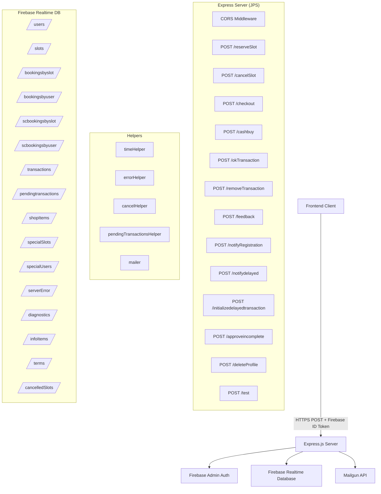

# Design Document - Varausserver Backend

## Overview

Varausserver is a Node.js/Express.js backend API for the "Hakolahdentie 2" sauna reservation system. It provides authenticated endpoints for slot reservations, cancellations, multiple payment flows (invoice/delayed, admin cash), transaction management, profile deletion with active booking guards, email notifications, and feedback processing. All data is persisted in Firebase Realtime Database, authentication uses Firebase Admin SDK token verification, and transactional emails are sent via Mailgun.

The server is built as a single Express application with a shared global state object (`JPS`) that is passed to all route modules and helpers. Each POST endpoint is defined in a separate module under `src/post/`, and shared logic lives in `src/helpers/`.

### Key Design Decisions

- **Global JPS object**: All modules share a single mutable `JPS` object for state, Firebase references, helpers, and request-scoped data. This is the existing pattern — not ideal for concurrency but functional for the current single-process deployment.
- **Firebase Admin SDK with service account override**: The server authenticates to Firebase as `uid: "varausserver"`, which is used in security rules to grant write access to booking and transaction paths.
- **Dual-write booking pattern**: Bookings are written to both `/bookingsbyslot/` (indexed by slot) and `/bookingsbyuser/` (indexed by user) for efficient querying from both directions.
- **Pending transaction pattern**: Delayed payments use a two-phase approach: create a pending transaction, then complete or cancel it after payment resolution.
- **Profile deletion order**: The deletion confirmation email is sent before the Firebase Auth account is deleted, because after Auth deletion the user's email is no longer retrievable. Email failure is non-blocking.
- **Active booking guard server-side**: The active booking check is enforced server-side (not just in the UI) to prevent race conditions and API misuse.

## Architecture



### Request Processing Flow

Every POST endpoint follows the same pattern:

1. Accumulate request body via `req.on('data')` events (with 1MB limit)
2. Parse JSON body on `req.on('end')`
3. Verify Firebase ID token via `admin.auth().verifyIdToken()`
4. Extract user UID from decoded token (`uid` or `sub` field)
5. Perform endpoint-specific business logic against Firebase DB
6. Return HTTP 200 on success or HTTP 500 on failure
7. Send email notification asynchronously (fire-and-forget)

## Components and Interfaces

### Server Entry Point (`src/server.js`)

Initializes Express, Firebase Admin SDK (production vs staging based on `NODE_ENV`), registers all middleware and route handlers, sets up process-level error handling.

**Environment-based configuration:**
- Production: `varaus-prod.json` service account, `https://hakolahdentie-2.firebaseio.com/`
- Staging: `varaus-stage.json` service account, `https://varaus-a0250.firebaseio.com/`

### CORS Middleware (`src/setHeaders.js`)

Sets response headers on every request:
- `Access-Control-Allow-Origin: *`
- `Access-Control-Allow-Methods: GET, POST`
- `Access-Control-Allow-Headers: content-type`
- `content-type: text/plain`

### API Endpoints (`src/post/`)


#### POST `/reserveSlot`
- **Module**: `postReserveSlot.js`
- **Auth**: Firebase ID token (any authenticated user)
- **Request body**: `{ user: string, slotInfo: { key, start, day }, weeksForward: number, timezoneOffset: number }`
- **Logic**:
  1. Verify token, look up `/users/{uid}`
  2. Read `/transactions/{uid}`, find non-expired entries with `unusedtimes > 0`
  3. Select earliest-expiring transaction, decrement `unusedtimes`
  4. Write booking to `/bookingsbyslot/{slotKey}/{bookingTime}/{userKey}` and `/bookingsbyuser/{userKey}/{slotKey}/{bookingTime}`
  5. Send confirmation email
- **Response**: 200 with "Booking done succesfully" or 500 with error

#### POST `/cancelSlot`
- **Module**: `postCancelSlot.js`
- **Auth**: Firebase ID token (any authenticated user)
- **Request body**: `{ user: string, slotInfo: { key }, cancelItem: number, transactionReference: number, timezoneOffset: number }`
- **Logic**:
  1. Verify token, look up user
  2. Verify booking exists in both `/bookingsbyslot/` and `/bookingsbyuser/`
  3. Remove from both paths
  4. If `transactionReference != 0` (count-based): increment `unusedtimes` on referenced transaction, send count cancellation email
  5. If `transactionReference == 0` (time-based): send time cancellation email
- **Response**: 200 with cancellation message or 500 with error

#### POST `/checkout`
- **Module**: `postCheckout.js`
- **Auth**: Firebase ID token (any authenticated user)
- **Request body**: `{ current_user: string, item_key: string }`
- **Logic**:
  1. Verify token, look up user and shop item from `/shopItems/{key}`
  2. Calculate expiry: `now + expiresAfterDays` shifted to end of day
  3. Set `unusedtimes = shopItem.usetimes`
  4. Write transaction to `/transactions/{userKey}/{timestamp}` with `paymentInstrumentType: "invoice"`
  5. Send receipt email
- **Response**: 200 with "Checkout successful." or 500 with error

#### POST `/cashbuy`
- **Module**: `postCashbuy.js`
- **Auth**: Firebase ID token (admin or instructor via `/specialUsers/`)
- **Request body**: `{ current_user: string, for_user: string, item_key: string, purchase_target: string }`
- **Logic**:
  1. Verify requesting user is admin/instructor
  2. Look up target user and shop item
  3. Process by type (count/time/special) with appropriate expiry logic
  4. For `special`: also write to `/scbookingsbyslot/` and `/scbookingsbyuser/`
  5. Write transaction to `/transactions/{forUserKey}/{timestamp}`
  6. Send receipt email to target user
- **Response**: 200 with transaction data or 500 with error

#### POST `/okTransaction`
- **Module**: `postOkTransaction.js`
- **Auth**: Firebase ID token (admin only via `/specialUsers/`)
- **Request body**: `{ current_user: string, for_user: string, transaction: { purchasetime: string } }`
- **Logic**: Set `paymentReceived: true` on `/transactions/{forUser}/{purchasetime}`
- **Response**: 200 with success message or 500 with error

#### POST `/removeTransaction`
- **Module**: `postRemoveTransaction.js`
- **Auth**: Firebase ID token (admin only via `/specialUsers/`)
- **Request body**: `{ current_user: string, for_user: string, transaction: { purchasetime: string, type: string, shopItemKey: string } }`
- **Logic**:
  1. Remove `/transactions/{forUser}/{purchasetime}`
  2. If type is `special`: also remove from `/scbookingsbyslot/` and `/scbookingsbyuser/`
- **Response**: 200 with success message or 500 with error

#### POST `/feedback`
- **Module**: `postFeedback.js`
- **Auth**: Firebase ID token (any authenticated user)
- **Request body**: `{ current_user: string, feedback_message: string }`
- **Logic**: Send feedback to configured address, send thank-you to user
- **Response**: 200 with "Feedback sent ok." or 500 with error

#### POST `/notifyRegistration`
- **Module**: `postNotifyRegistration.js`
- **Auth**: Firebase ID token (any authenticated user)
- **Request body**: `{ current_user: string }`
- **Logic**: Look up user, send registration notification email to configured address
- **Response**: 200 with "Notification sent ok." or 500 with error

#### POST `/notifydelayed`
- **Module**: `postNotifyDelayed.js`
- **Auth**: Firebase ID token (any authenticated user)
- **Request body**: `{ current_user: string, transaction: string }`
- **Logic**: Look up user, send delayed purchase notification to configured address
- **Response**: 200 with "Notify sent ok." or 500 with error

#### POST `/initializedelayedtransaction`
- **Module**: `postInitializeDelayedTransaction.js`
- **Auth**: Firebase ID token (any authenticated user)
- **Request body**: `{ current_user: string, item_key: string, purchase_target: string }`
- **Logic**: Identical to the pending transaction creation pattern — creates pending transaction under `/pendingtransactions/` with type-based expiry logic
- **Response**: 200 with pending transaction key or 500 with error

#### POST `/approveincomplete`
- **Module**: `postApproveIncomplete.js`
- **Auth**: Firebase ID token (admin or instructor via `/specialUsers/`)
- **Request body**: `{ current_user: string, pending_transaction_id: string }`
- **Logic**: Complete pending transaction via `pendingTransactionsHelper` with `paymentInstrumentType: "Admin"`
- **Response**: 200 on success or 500 with error

#### POST `/test`
- **Module**: `tests/postTest.js`
- **Auth**: Firebase ID token (any authenticated user)
- **Request body**: `{ current_user: string, test_case: string }`
- **Logic**: Execute named test case (currently only `firebase_error_log`)
- **Response**: 200 on success or 500 with error

#### POST `/deleteProfile`
- **Module**: `postDeleteProfile.js`
- **Auth**: Firebase ID token (any authenticated user, via authMiddleware)
- **Request body**: `{ }` (user identity from verified token)
- **Logic**:
  1. Get uid from `req.auth` (set by authMiddleware)
  2. Read `/bookingsbyuser/{uid}` and check for active bookings (slot end time in the future)
  3. If active bookings exist → return HTTP 409
  4. Delete `/users/{uid}`, `/bookingsbyuser/{uid}`, `/transactions/{uid}`, `/specialUsers/{uid}` from Firebase RTDB
  5. Send deletion confirmation email via `JPS.mailer.sendDeletionConfirmation()` before deleting Auth account
  6. Delete Firebase Auth account via `admin.auth().deleteUser(uid)`
- **Response**: 200 on success, 409 if active bookings, 500 on error

### Helper Modules (`src/helpers/`)

#### `timeHelper.js`
- `getSlotTimeLocal(weeksForward, timeOfStart, dayNumber)` — Calculates absolute slot time from relative week/day/time parameters
- `getDayStr(day)` — Formats Date as `"day.month.year"` string
- `getTimeStr(day)` — Returns `day.toTimeString()`
- `getUntilEndOfDayMsFromNow(now)` — Returns milliseconds remaining until end of day
- `shiftUntilEndOfDayMs(now)` — Shifts timestamp to 23:59:59.999 of that day, returns the shifted timestamp

#### `errorHelper.js`
- `logErrorToFirebase(JPS, error)` — Writes error to `/serverError/{timestamp}` in Firebase

#### `cancelHelper.js`
- `cancelSlot(JPS, user, slotInfo, slotInstance, transactionReference)` — Shared cancellation logic (verify booking exists, remove from both paths, restore credits if count-based). Note: this helper exists but the `postCancelSlot.js` endpoint implements the logic inline rather than using it.

#### `pendingTransactionsHelper.js`
- `completePendingTransaction(JPS, pendingTransactionKey, externalReference, paymentInstrumentType, paymentMethod)` — Reads pending transaction, moves it to `/transactions/{userId}/{timestamp}`, removes pending record, handles special-type SC bookings, sends receipt email.

#### `mailer.js`
- `initializeMail(jps)` — Initializes Mailgun client with env vars
- `sendConfirmation(sendTo, slotInfo, slotTime)` — Booking confirmation with day/time
- `sendCancellationCount(sendTo, slotInfo, slotTimeMs)` — Count-based cancellation confirmation with credit restored message
- `sendReceipt(sendTo, trx, trxId)` — Purchase receipt with product details, tax breakdown, expiry, purchase ID
- `sendThankyouForFeedback(user)` — Feedback acknowledgement
- `sendFeedback(user, feedback)` — Forward feedback to admin
- `sendRegistration(user)` — Registration notification to admin
- `sendNotifyDelayed(user, transaction)` — Delayed purchase notification to admin
- `sendDeletionConfirmation(email, deletionDate)` — Profile deletion confirmation to user with email and deletion date; non-blocking (logs errors but does not throw)

**Environment variables for mailer:**
- `MAILGUN_API_KEY` — Mailgun API key
- `MAILGUN_DOMAIN` — Mailgun domain
- `MAILGUN_FROM_WHO` — Sender address
- `FEEDBACK_ADDRESS` — Feedback recipient
- `NOTIFY_ADDRESS` — Purchase notification recipient
- `REGISTRATION_ADDRESS` — Registration notification recipient

## Data Models

### Firebase Realtime Database Schema


```
Firebase Realtime Database
├── /users/{userId}
│   ├── email: string
│   ├── firstname: string
│   ├── lastname: string
│   └── alias: string (optional)
│
├── /specialUsers/{userId}
│   ├── admin: boolean
│   └── instructor: boolean
│
├── /shopItems/{itemKey}
│   ├── title: string
│   ├── desc: string
│   ├── price: number
│   ├── beforetax: number
│   ├── taxpercent: number
│   ├── taxamount: number
│   ├── type: "count" | "time" | "special"
│   ├── usetimes: number (count-type)
│   ├── usedays: number (time-type)
│   └── expiresAfterDays: number (count-type)
│
├── /specialSlots/{slotKey}
│   ├── (same fields as shopItems)
│   └── type: "special"
│
├── /slots/
│   └── (slot definitions, read by frontend)
│
├── /cancelledSlots/
│   └── (cancelled slot records)
│
├── /bookingsbyslot/{slotKey}/{bookingTime}/{userKey}
│   ├── user: string (display name or alias)
│   ├── transactionReference: number (0 for time-based, timestamp for count-based)
│   └── slotTime: number (ms timestamp)
│
├── /bookingsbyuser/{userKey}/{slotKey}/{bookingTime}
│   ├── transactionReference: number
│   └── slotTime: number
│
├── /scbookingsbyslot/{shopItemKey}/{userKey}
│   ├── transactionReference: number (timestamp)
│   └── shopItem: object
│
├── /scbookingsbyuser/{userKey}/{shopItemKey}
│   ├── transactionReference: number (timestamp)
│   └── shopItem: object
│
├── /transactions/{userId}/{timestamp}
│   ├── user: string (userId)
│   ├── shopItem: object
│   ├── shopItemKey: string
│   ├── title: string
│   ├── desc: string
│   ├── price: number
│   ├── beforetax: number
│   ├── taxpercent: number
│   ├── taxamount: number
│   ├── type: "count" | "time" | "special"
│   ├── expires: number (ms timestamp, 0 for special)
│   ├── unusedtimes: number (count-type)
│   ├── paymentReceived: boolean (set by admin via okTransaction)
│   ├── error: { code: number }
│   └── details: {
│       ├── success: boolean
│       └── transaction: {
│           ├── amount: number|string
│           ├── currencyIsoCode: "EUR"
│           ├── id: string|number
│           ├── paymentInstrumentType: "invoice"|"cash"|"Admin"
│           ├── paymentMethod: string|null
│           └── pendingTransaction: string (delayed payment only)
│       }
│   }
│
├── /pendingtransactions/{pushKey}
│   ├── transaction: {
│   │   ├── user: string
│   │   ├── shopItem: object
│   │   ├── shopItemKey: string
│   │   ├── error: { code: 0 }
│   │   └── details: "pending"
│   │ }
│   ├── shopItem: object (with calculated expires, unusedtimes)
│   ├── user: string (userId)
│   ├── receiptEmail: string
│   └── timestamp: number (ms)
│
├── /serverError/{timestamp}
│   └── error: object
│
├── /infoItems/
│   └── (public info content)
│
├── /terms/
│   └── (public terms content)
│
└── /diagnostics/
    └── (diagnostic data)
```

### Transaction Types

| Type | Expiry Calculation | Key Fields |
|------|-------------------|------------|
| `count` | `now + expiresAfterDays` → end of day (23:59:59.999) | `unusedtimes`, `expires` |
| `time` | Latest existing time-transaction expiry + `usedays` → end of day | `expires` |
| `special` | `expires = 0` (no expiry) | SC booking records created |

### Payment Instrument Types

| Type | Source | Description |
|------|--------|-------------|
| `invoice` | `/checkout` endpoint | Delayed/invoice payment |
| `cash` | `/cashbuy` endpoint | In-person cash payment by admin/instructor |
| `Admin` | `/approveincomplete` endpoint | Admin-approved pending transaction |


## Correctness Properties

*A property is a characteristic or behavior that should hold true across all valid executions of a system — essentially, a formal statement about what the system should do. Properties serve as the bridge between human-readable specifications and machine-verifiable correctness guarantees.*

### Property 1: End-of-day time shift invariant

*For any* timestamp (in milliseconds), `shiftUntilEndOfDayMs(timestamp)` should return a timestamp on the same calendar day with hours=23, minutes=59, seconds=59, milliseconds=999, and the result should always be >= the input.

**Validates: Requirements 13.2, 6.3**

### Property 2: Slot time calculation correctness

*For any* valid combination of `weeksForward` (non-negative integer), `dayNumber` (1–7), and `timeOfStart` (milliseconds within a day), `getSlotTimeLocal(weeksForward, timeOfStart, dayNumber)` should return a Date whose day-of-week matches `dayNumber` and whose time-of-day component equals `timeOfStart`.

**Validates: Requirements 13.1**

### Property 3: Date formatting structure

*For any* valid Date object, `getDayStr(date)` should return a string matching the pattern `D.M.YYYY` where D is the day of month, M is the 1-based month, and YYYY is the full year. Parsing the result back should yield the same day, month, and year.

**Validates: Requirements 13.3**

### Property 4: Reserve-cancel credit round trip

*For any* user with a count-based transaction having `unusedtimes > 0`, reserving a slot (which decrements `unusedtimes` by 1) followed by cancelling that same slot (which increments `unusedtimes` by 1) should restore `unusedtimes` to its original value.

**Validates: Requirements 4.5, 5.5**

### Property 5: Earliest-expiring transaction selection

*For any* set of user transactions where at least one has `expires > now` and `unusedtimes > 0`, the reservation logic should select the transaction with the smallest `expires` value among all valid transactions, and decrement only that transaction's `unusedtimes`.

**Validates: Requirements 4.3, 4.5**

### Property 6: Dual-write booking consistency

*For any* successful slot reservation, the booking data should exist at both `/bookingsbyslot/{slotKey}/{bookingTime}/{userKey}` and `/bookingsbyuser/{userKey}/{slotKey}/{bookingTime}`. Conversely, for any successful cancellation, the booking should be removed from both paths.

**Validates: Requirements 4.6, 5.2, 5.4**

### Property 7: Pending transaction lifecycle

*For any* valid shop item (count, time, or special type), initializing a pending transaction should create a record under `/pendingtransactions/` containing the transaction details, shop item with correctly calculated expiry, user key, receipt email, and timestamp. Completing that pending transaction should move the data to `/transactions/{userId}/{timestamp}` and remove the pending record.

**Validates: Requirements 7.1, 7.2**

### Property 8: Checkout transaction structure invariant

*For any* checkout with a count-type shop item, the written transaction should have `unusedtimes` equal to `shopItem.usetimes`, `paymentInstrumentType` equal to `"invoice"`, `currencyIsoCode` equal to `"EUR"`, and `expires` equal to the end-of-day shifted value of `now + expiresAfterDays * 86400000`.

**Validates: Requirements 6.4, 6.5**

### Property 9: Special-type SC booking round trip

*For any* special-type purchase (via cashbuy or completed pending transaction), booking records should be written to both `/scbookingsbyslot/{shopItemKey}/{userKey}` and `/scbookingsbyuser/{userKey}/{shopItemKey}`. Removing that transaction via `/removeTransaction` should also remove both SC booking records.

**Validates: Requirements 8.5, 8.5**

### Property 10: Admin authorization gate

*For any* user whose `/specialUsers/{uid}` record does not have `admin: true` (or `instructor: true` for cashbuy/approveincomplete), requesting a privileged endpoint (`/cashbuy`, `/okTransaction`, `/removeTransaction`, `/approveincomplete`) should return HTTP 500 with an authorization error.

**Validates: Requirements 3.4, 3.5, 7.1, 7.2**

### Property 11: Email content completeness

*For any* transaction object, `sendReceipt` should produce HTML containing the product title, description, before-tax price, VAT percentage, VAT amount, total price, currency code "EUR", and purchase identifier. *For any* slot time, `sendConfirmation` should produce HTML containing the formatted day and time strings. *For any* cancellation with count-based booking, `sendCancellationCount` should produce HTML containing the formatted day, time, and credit restoration message.

**Validates: Requirements 9.2, 9.3, 9.4**

### Property 12: Uninitialized mailer safety

*For any* mailer function (`sendConfirmation`, `sendCancellationCount`, `sendReceipt`, `sendThankyouForFeedback`, `sendFeedback`, `sendRegistration`, `sendNotifyDelayed`), calling it when the mailer is not initialized (missing API key) should return without throwing an error and without attempting to send.

**Validates: Requirements 9.9**

### Property 13: Request body size limit enforcement

*For any* POST endpoint, if the accumulated request body exceeds 1MB (1e6 bytes), the server should destroy the connection.

**Validates: Requirements 4.8**

### Property 14: Error logging to Firebase

*For any* error object, `logErrorToFirebase` should write the error to `/serverError/{timestamp}` where timestamp is the current time in milliseconds.

**Validates: Requirements 11.1**

### Property 15: Time-type expiry extension

*For any* user with existing time-type transactions, purchasing a new time-type item should set the new transaction's expiry to the end-of-day of (latest existing time expiry + usedays), not from the current time. If no existing time transactions exist, it should calculate from the current time.

**Validates: Requirements 7.2, 7.4**

### Property 16: Active booking detection for profile deletion

*For any* set of bookings, a booking is active if and only if its slot end time (slotTime + slotInfo.end - slotInfo.start) is in the future. The deletion endpoint should return HTTP 409 when any active booking exists.

**Validates: Requirements 15.1**

### Property 17: Profile deletion data completeness

*For any* authenticated user with no active bookings, the deletion endpoint should remove all four database paths (`/users/{uid}`, `/bookingsbyuser/{uid}`, `/transactions/{uid}`, `/specialUsers/{uid}`), send a deletion confirmation email, and then delete the Firebase Auth account.

**Validates: Requirements 14.2, 14.3, 16.1**

### Property 18: Deletion email before auth removal

*For any* successful profile deletion, the deletion confirmation email should be sent before the Firebase Auth account is deleted. If the email fails, the Auth deletion should still proceed.

**Validates: Requirements 16.1, 16.3**

## Error Handling

### Endpoint Error Pattern

All endpoints follow a consistent error handling pattern:

1. **Token verification failure**: Returns HTTP 500 with error message string. The catch block at the end of each promise chain handles this.
2. **User not found**: Throws an Error with message "User record does not exist in the database: {uid}" or "User was not found in db: {uid}", caught by the chain's catch handler → HTTP 500.
3. **Authorization failure**: Throws an Error with "Non admin or instructor user requesting cashbuy." → HTTP 500.
4. **Business logic failure** (e.g., no entitlement, booking not found, transaction not found): Throws specific Error messages → HTTP 500.
5. **Firebase write failure**: Caught in nested promise chains, re-thrown to outer catch → HTTP 500.

### Error Response Formats

The error response format is inconsistent across endpoints:
- Some return `res.status(500).jsonp({ message: "..." }).end()`
- Some return `res.status(500).jsonp("string message").end()`
- Some pass the error object to `.end(err)` in addition to the JSON response

### Process-Level Error Handling

- `uncaughtException` handler writes to `/serverError/{timestamp}` via `errorHelper.logErrorToFirebase()`
- If the Firebase write itself fails, the error is logged to console
- `exit` handler logs the exit code to console

### Email Error Handling

- Mailgun send errors are logged to console but do not affect the HTTP response (fire-and-forget pattern)
- If the mailer is not initialized, all send functions return early without error

### Request Size Protection

- Every endpoint checks `JPS.body.length > 1e6` during data accumulation and calls `req.connection.destroy()` if exceeded

## Testing Strategy

### Property-Based Testing

Use `fast-check` as the property-based testing library for JavaScript/Node.js.

Each property test should:
- Run a minimum of 100 iterations
- Reference the design property with a comment tag: `Feature: varausserver, Property {N}: {title}`
- Use `fast-check` arbitraries to generate random inputs

**Pure function properties (Properties 1–3)** can be tested directly against `timeHelper` functions with generated timestamps, day numbers, and time offsets.

**Business logic properties (Properties 4–6, 7–15)** require mocking Firebase database operations. Use a mock Firebase layer that simulates `ref().once('value')`, `ref().update()`, `ref().remove()`, and `ref().set()` against an in-memory data store. This allows testing the full endpoint logic without a live Firebase connection.

**Mailer properties (Properties 11–12)** can be tested by capturing the HTML output from mailer functions with a mock Mailgun client.

### Unit Testing

Unit tests should cover:
- Specific examples for each endpoint's happy path (one concrete request/response per endpoint)
- Edge cases: missing user, missing booking, expired transactions, zero unusedtimes, empty transaction list
- Authorization edge cases: user with `admin: false`, user with no specialUsers record
- Special-type transaction removal with SC booking cleanup

### Test Organization

```
tests/
├── unit/
│   ├── timeHelper.test.js        # Properties 1-3
│   ├── errorHelper.test.js       # Property 15
│   ├── mailer.test.js            # Properties 12-13
│   ├── reserveSlot.test.js       # Properties 4-6
│   ├── cancelSlot.test.js        # Properties 4, 6
│   ├── checkout.test.js          # Property 8
│   ├── cashbuy.test.js           # Properties 9-10
│   ├── adminOps.test.js          # Properties 9-10
│   └── bodyLimit.test.js         # Property 13
└── property/
    ├── timeHelper.property.js    # Properties 1-3
    ├── creditRoundTrip.property.js # Property 4
    ├── earliestExpiry.property.js  # Property 5
    ├── dualWrite.property.js       # Property 6
    ├── pendingLifecycle.property.js # Property 7
    ├── checkoutStructure.property.js # Property 8
    ├── scBookingRoundTrip.property.js # Property 9
    ├── adminAuth.property.js       # Property 10
    ├── emailContent.property.js    # Property 11
    ├── mailerSafety.property.js    # Property 12
    ├── bodyLimit.property.js       # Property 13
    ├── errorLogging.property.js    # Property 14
    └── timeExpiry.property.js      # Property 15
    ├── activeBookingDetection.property.js # Property 16
    ├── profileDeletion.property.js  # Property 17
    └── deletionEmailOrder.property.js # Property 18
```

### Testing Dependencies

- `fast-check` — Property-based testing library
- `jest` or `mocha` — Test runner
- Mock Firebase Admin SDK (in-memory database simulation)
- Mock Mailgun client (capture sent messages)
